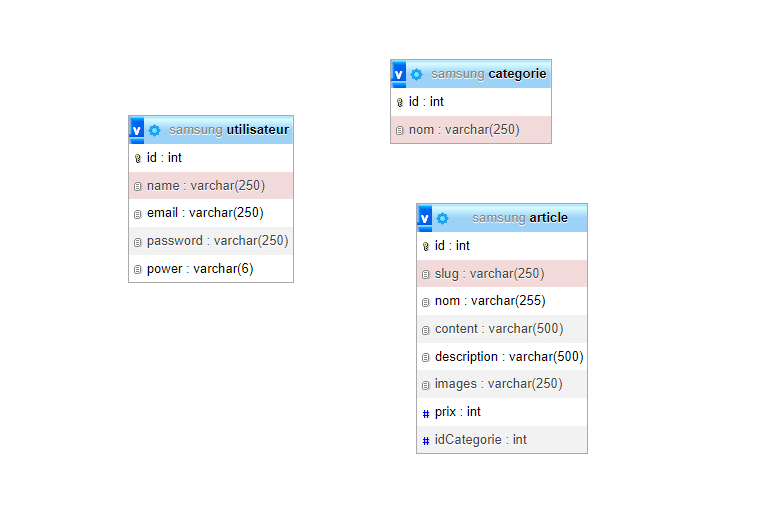

# E-Commerce Samsung

## Prérequis
Pour utiliser ce projet, plusieurs prérequis sont nécessaires :

### Installation de la base de données
Une version de la base de données est disponible à la racine du projet. Elle s'appelle samsung.sql. Il s'agit d'un script SQL à exécuter, pas d'un export de PHPMyAdmin. Cependant, une version exportée est également disponible.

### Configurer le projet
À la racine du projet, vous trouverez un fichier nommé exemple_option.php. Pour que le projet fonctionne correctement, il est nécessaire de suivre les étapes suivantes :
- Renommer le fichier en option.php
- Remplir les informations présentes.

# MCD

# Tester le projet

## Se connecter
Il est possible de se créer un compte, mais il sera forcément utilisateur.
Pour un test rapide plusieurs utilisateurs ont déjà été créé

### Utilisateurs

Email : demo@demo.fr

Mot de passe : demo

### Administrateur

Email : admin@admin.fr

Mot de passe : admin

## Ajouter des articles

Pour les administrateurs une interface backoffice peut être utilisé pour ajouter des articles à la base de données.

Pour ajouter une image il faut entrer le lien vers une image présente dans le dossier staticfiles/mdeias/articles/<nom de l'image>

C'est pour cela que j'ai ajouté quelque images qui n'ont pas été utilisé pour tester l'ajout d'articles.

Ces noms d'images sont 

- staticfiles/medias/articles/Galaxy_watch5_4G.webp
- staticfiles/medias/articles/galaxy_watch5.webp
- staticfiles/medias/articles/TV_neo_oled.webp
- staticfiles/medias/articles/TV_oled.webp

# Mentions spéciales

Pour réaliser le routeur et le MVC j'ai suivi le tutoriel de la chaîne : Nouvelle Techno
Le projet est disponible ici : https://github.com/NouvelleTechno/mvc-php